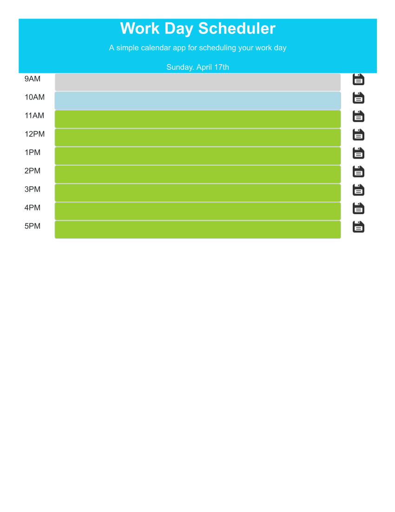

# UNH_bootcamp-05-Day_Scheduler
Schedule each hour of the day

You may enter a task in each one-hour time block.
When you click the Save icon at the right of a time block
the task for that hour is saved locally.

The github repository for the application is at
https://github.com/JohnSauter/UNH_bootcamp-05-Day_Scheduler
and the application itself is available at
https://johnsauter.github.io/UNH_bootcamp-05-Day_Scheduler/

The following is a screen shot taken between 10:00 and 10:59,
with no tasks scheduled for the day.

